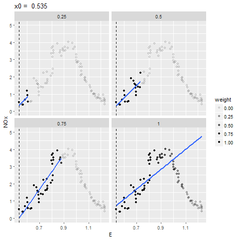
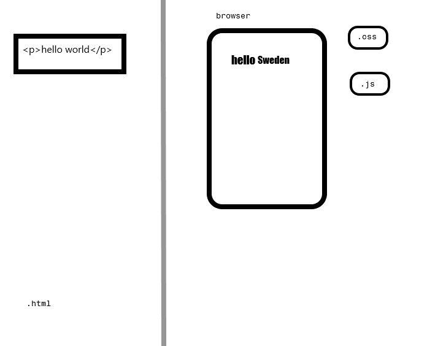
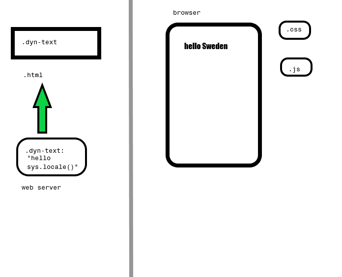

```{r setup, include=FALSE}
knitr::opts_chunk$set(echo = FALSE)
```

# What?


## Interactive graphics

```{r init, include = FALSE}
library(lattice)
library(ggplot2)
library(gganimate)
library(broom)
library(gridSVG)
library(grid)
library(survival)
library(dplyr)
library(gapminder)
library(plotROC)
```


Compared to static figures/tables:

- Increase density of information
- Enhance dimensionality of a figure
- Ease of access to information


# Examples


## Density of information

[gapminder](http://www.gapminder.org/tools/#_state_time_delay:100;;&chart-type=bubbles)


## Static approach

```{r g1}
ggplot(gapminder, aes(x = gdpPercap, y = lifeExp, color = continent, size = pop)) +
   geom_point()  + scale_x_log10() + facet_wrap(~ year)
```


## Enhance dimensionality


## Enhance dimensionality (2)


```{r, eval = FALSE}
spans <- c(.25, .5, .75, 1)

data(ethanol)
# create loess fits, one for each span
fits <- data_frame(span = spans) %>%
  group_by(span) %>%
  do(augment(loess(NOx ~ E, ethanol, degree = 1, span = .$span)))

# calculate weights to reproduce this with local weighted fits
dat <- ethanol %>%
  inflate(span = spans, center = unique(ethanol$E)) %>%
  mutate(dist = abs(E - center)) %>%
  filter(rank(dist) / n() <= span) %>%
  mutate(weight = (1 - (dist / max(dist)) ^ 3) ^ 3)

# create faceted plot with changing points, local linear fits, and vertical lines,
# and constant hollow points and loess fit
p <- ggplot(dat, aes(E, NOx)) +
  geom_point(aes(alpha = weight, frame = center)) +
  geom_smooth(aes(group = center, frame = center, weight = weight), method = "lm", se = FALSE) +
  geom_vline(aes(xintercept = center, frame = center), lty = 2) +
  geom_point(shape = 1, data = ethanol, alpha = .25) +
  geom_line(aes(y = .fitted, frame = E, cumulative = TRUE), data = fits, color = "red") +
  facet_wrap(~span) +
  ylim(0, 5) +
  ggtitle("x0 = ")

ani.options(convert = "C:/Users/micsac/convert.exe")
gganimate(p, file = "C:/Users/micsac/test.gif", interval = .2)
```





## Access to information

```{r rocex, include = FALSE}
set.seed(2529)
library(plotROC)

D.ex <- rbinom(200, size = 1, prob = .5)
M1 <- rnorm(200, mean = D.ex, sd = .65)
M2 <- rnorm(200, mean = D.ex, sd = 1.5)

test <- data.frame(D = D.ex, D.str = c("Healthy", "Ill")[D.ex + 1], 
                   M1 = M1, M2 = M2, stringsAsFactors = FALSE)

```


```{r roccd, results = "asis"}


p1 <- ggplot(test, aes(d = D, m = M1)) + geom_roc()
cat(export_interactive_roc(p1, 
                        prefix = "a"))
```


## Static version

```{r roccd2}
p1 + geom_rocci() + style_roc()
```


# Why?

## Reduced cognitive burden

- A geometric element that represents a data point can be tracked visually through the transition
- Pre-attentive processing of motion > scanning + matching of labels/colors

$\rightarrow$ enhances viewer's understanding + insight


# Where? 


## Web browser

- Cross platform and portable/easy to share
- Lot's of existing infrastructure and tools


## Servers and browsers

A static web page


## Servers and browsers (2)

A static web page


## Servers and browsers (3)

A static web page




## Servers and browsers

A dynamic web page



## SVG

"Scalable Vector Graphics"


# How?


## Rendering

```{r, echo = FALSE, fig.width = 4, fig.height = 4, fig.align = "left"}
mtcars %>% select(mpg, hp) %>% head(1) %>% ggplot(aes(mpg, hp)) + geom_point(size = 5) + 
  scale_x_continuous("", labels = NULL) + scale_y_continuous("", labels = NULL) + theme_minimal()
```

```
<symbol id="gridSVG.pch19" viewBox="-5 -5 10 10" overflow="visible">
          <circle cx="0" cy="0" r="3.75"/>
</symbol>
```

## Modify rendered elements

<div class="centered">

```{r, echo = FALSE, fig.width = 2, fig.height = 2, fig.keep='none', results = 'asis', fig.align = "center"}
pexsm <- mtcars %>% select(mpg, hp) %>% head(1) %>% ggplot(aes(mpg, hp)) + geom_point(size = 5) + 
    scale_x_continuous("", labels = NULL) + scale_y_continuous("", labels = NULL) + theme_minimal()
pexsm
grid::grid.force()
tnm <- gridSVG::grid.export(NULL)
nme <- grep("points", names(tnm$mappings$grobs), value = TRUE)

tnm$svg


```

</div>

```js
d3.select("gridSVG.pch19")
  .move(Math.random());
```


<script type="text/javascript">

var thispt = d3.select("[id^='`r noquote(nme)`.1.1']")

var curx = thispt.attr("x")
var cury = thispt.attr("y")
var count = 1

var move = setInterval(function(){
	
	if(count >= 10){
	    thispt.transition().duration(100)
	    .attr("x", curx)
	    .attr("y", cury);
		count = 1;
	} else {
	
  thispt.transition().duration(500)
  .attr("x", 210 + (.5 - Math.random()) * 200)
  .attr("y", 210 + (.5 - Math.random()) * 200);
 	count++
}
}, 1000);

</script>


## Current approaches

<div id="slider"></div>

<div>
<svg height = "50" width = "960">
<text x=100 y=40 class="first text1"> 
htmlwidgets, ggvis, qtlcharts, animint, rCharts, plotly
</text>
<text x=300 y=40 class = "second text2" fill = "red">
ggplot2+gridSVG
</text>
<text x=375 y=40 class = "third text2">
shiny
</text>
</svg>
</div>

<div>
<svg height = "400" width = "960">
<path transform="translate(160, 0) scale(2.5)" style="fill:#010002;" d="M22.939,10.918c-0.705-1.712-2.037-2.581-3.961-2.581c0,0-1.263,0-2.306,0   c0.39-0.881,0.824-2.159,0.824-3.699c0-0.422-0.033-0.86-0.113-1.306c-0.303-1.79-1.525-2.742-3.262-2.551   c-0.688,0.079-0.924,0.732-1.494,2.315c-0.473,1.312-1.121,3.109-2.061,4.554c-0.691,1.062-1.922,1.9-2.956,2.416V9.935H0v11.307   h7.612v-0.623c1.198-0.059,1.879-0.024,2.039,0.027l1.362,0.791l1.018,0.635c0.989,0.533,5.315,0.584,7.17,0.309   c2.385-0.348,2.961-2.303,2.985-2.387C22.374,19.346,24.015,13.529,22.939,10.918z M20.749,19.583   c-0.014,0.043-0.361,1.114-1.765,1.315c-1.996,0.297-5.698,0.117-6.247-0.145c0.004,0.003-0.903-0.566-0.903-0.566l-1.711-0.961   c-0.397-0.133-1.297-0.148-2.511-0.094v-7.448c1.226-0.496,3.125-1.561,4.208-3.218c1.036-1.59,1.718-3.481,2.216-4.864   c0,0,0.439-1.093,0.545-1.346c0.758,0.004,1.176,0.421,1.332,1.324c0.062,0.354,0.086,0.705,0.086,1.044   c0,2.241-1.151,4.025-1.168,4.047l-0.759,1.157l4.906,0.002c1.312,0,2.106,0.511,2.579,1.657   C22.301,13.292,21.221,17.945,20.749,19.583z"></path>
<path transform="translate(660, 60) scale(2.5) rotate(180)" style="fill:#010002;" d="M22.939,10.918c-0.705-1.712-2.037-2.581-3.961-2.581c0,0-1.263,0-2.306,0   c0.39-0.881,0.824-2.159,0.824-3.699c0-0.422-0.033-0.86-0.113-1.306c-0.303-1.79-1.525-2.742-3.262-2.551   c-0.688,0.079-0.924,0.732-1.494,2.315c-0.473,1.312-1.121,3.109-2.061,4.554c-0.691,1.062-1.922,1.9-2.956,2.416V9.935H0v11.307   h7.612v-0.623c1.198-0.059,1.879-0.024,2.039,0.027l1.362,0.791l1.018,0.635c0.989,0.533,5.315,0.584,7.17,0.309   c2.385-0.348,2.961-2.303,2.985-2.387C22.374,19.346,24.015,13.529,22.939,10.918z M20.749,19.583   c-0.014,0.043-0.361,1.114-1.765,1.315c-1.996,0.297-5.698,0.117-6.247-0.145c0.004,0.003-0.903-0.566-0.903-0.566l-1.711-0.961   c-0.397-0.133-1.297-0.148-2.511-0.094v-7.448c1.226-0.496,3.125-1.561,4.208-3.218c1.036-1.59,1.718-3.481,2.216-4.864   c0,0,0.439-1.093,0.545-1.346c0.758,0.004,1.176,0.421,1.332,1.324c0.062,0.354,0.086,0.705,0.086,1.044   c0,2.241-1.151,4.025-1.168,4.047l-0.759,1.157l4.906,0.002c1.312,0,2.106,0.511,2.579,1.657   C22.301,13.292,21.221,17.945,20.749,19.583z"></path>
<g class="first">
<text x=100 y=100> 
User only writes R
</text>
<text x=100 y=140> 
Standalone document
</text>
<text x=500 y=100>
Stuck with libs visual identity
</text>
<text x=500 y=140>
No recalculations in R
</text>
</g>
<g class="second">
<text x=100 y=100> 
Look of R/ggplot2
</text>
<text x=100 y=140> 
Standalone document
</text>
<text x=500 y=100>
No recalculations in R
</text>
<text x=500 y=140>
Some JS needed
</text>
</g>
<g class="third">
<text x=100 y=100> 
User only writes R
</text>
<text x=100 y=140> 
Can do R computations
</text>
<text x=500 y=100>
Needs shiny server
</text>
</g>
</svg>
</div>


<script src="slidersummary.js"></script>


# Conclusion

## For your consideration

- Animation/interactivity should only be used when it enhances understanding
- Use is widespread in blogs/webpages, but only emerging in scientific publishing (e.g., Elsevier)

R users have a wealth of resources to create interactive graphics:

- Link to JavaScript libraries
- Rendering in R, get interactivity for free
- Shiny server 

Interesting applications:

- Summarizing complex data analysis
- Illustrating statistical concepts


