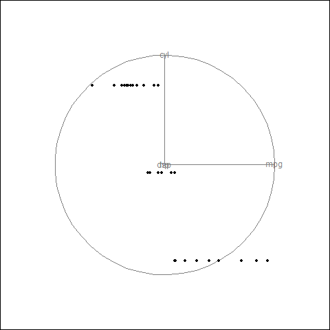

```{r setup, include=FALSE}
knitr::opts_chunk$set(echo = FALSE)
```

# What?


## Interactive graphics

```{r init, include = FALSE}
library(ggplot2)
library(gridSVG)
library(grid)
library(survival)
library(dplyr)
library(gapminder)
library(plotROC)
```


Compared to static figures/tables:

- Increase density of information
- Enhance dimensionality of a figure
- Ease of access to information
- Agnostic approach to information access


# Examples


## Density of information

[gapminder](http://www.gapminder.org/tools/#_state_time_delay:100;;&chart-type=bubbles)


## Static approach

```{r g1}
ggplot(gapminder, aes(x = gdpPercap, y = lifeExp, color = continent, size = pop)) +
   geom_point()  + scale_x_log10() + facet_wrap(~ year)
```


## Enhance dimensionality




## Access to information

```{r rocex, include = FALSE}
set.seed(2529)
library(plotROC)

D.ex <- rbinom(200, size = 1, prob = .5)
M1 <- rnorm(200, mean = D.ex, sd = .65)
M2 <- rnorm(200, mean = D.ex, sd = 1.5)

test <- data.frame(D = D.ex, D.str = c("Healthy", "Ill")[D.ex + 1], 
                   M1 = M1, M2 = M2, stringsAsFactors = FALSE)

```


```{r roccd, results = "asis"}


p1 <- ggplot(test, aes(d = D, m = M1)) + geom_roc()
cat(export_interactive_roc(p1, 
                        prefix = "a"))
```


## Static version

```{r roccd2}
p1 + geom_rocci() + style_roc()
```


# How?


## Rendering

```{r, echo = FALSE, fig.width = 4, fig.height = 4, fig.align = "left"}
mtcars %>% select(mpg, hp) %>% head(1) %>% ggplot(aes(mpg, hp)) + geom_point(size = 5) + 
  scale_x_continuous("", labels = NULL) + scale_y_continuous("", labels = NULL) + theme_minimal()
```


## Modify rendered elements

<div class="centered">

```{r, echo = FALSE, fig.width = 2, fig.height = 2, fig.keep='none', results = 'asis', fig.align = "center"}
pexsm <- mtcars %>% select(mpg, hp) %>% head(1) %>% ggplot(aes(mpg, hp)) + geom_point(size = 5) + 
    scale_x_continuous("", labels = NULL) + scale_y_continuous("", labels = NULL) + theme_minimal()
pexsm
grid::grid.force()
tnm <- gridSVG::grid.export(NULL)
nme <- grep("points", names(tnm$mappings$grobs), value = TRUE)

tnm$svg


```

</div>

<script type="text/javascript">

var thispt = d3.select("[id^='`r noquote(nme)`.1.1']")

var curx = thispt.attr("x")
var cury = thispt.attr("y")
var count = 1

var move = setInterval(function(){
	
	if(count >= 10){
	    thispt.transition().duration(100)
	    .attr("x", curx)
	    .attr("y", cury);
		count = 1;
	} else {
	
  thispt.transition().duration(500)
  .attr("x", 210 + (.5 - Math.random()) * 200)
  .attr("y", 210 + (.5 - Math.random()) * 200);
 	count++
}
}, 1000);

</script>
